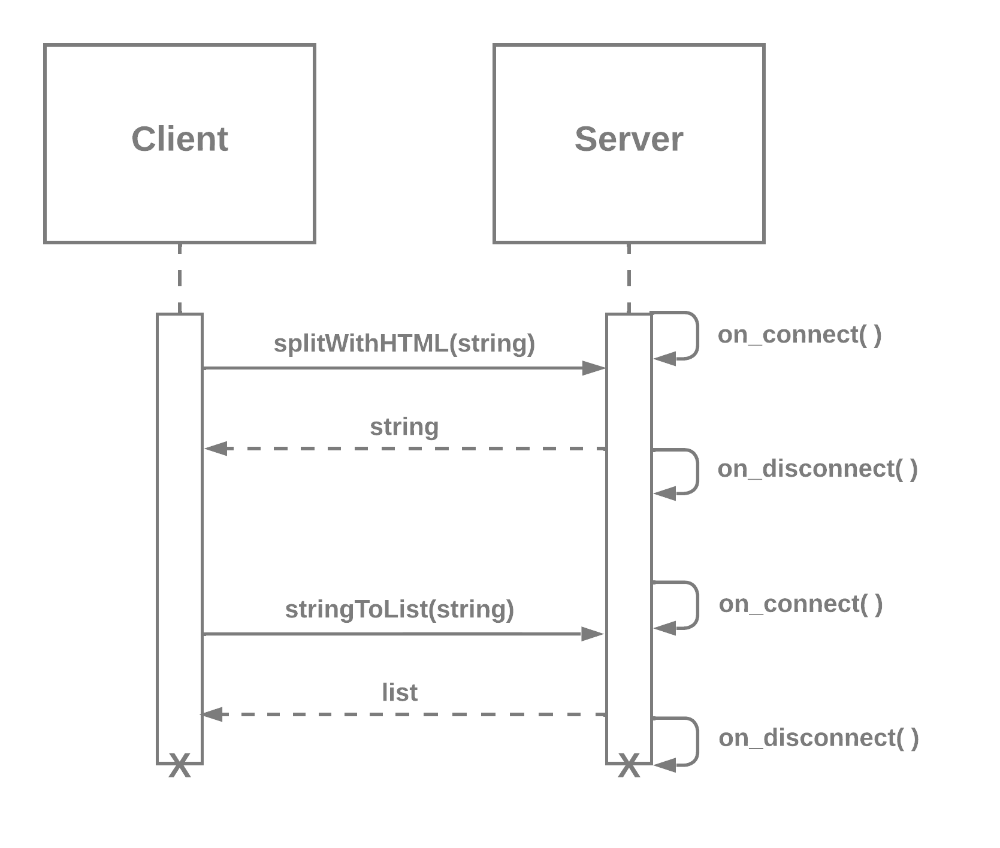

# CS361-Microservices-Implementation
Milestone #2 - Communication contract for String Parsing Microservice

---
## Background
This microservice leverages a remote procedure call Python library `RPyC` to
receive a string input and parse it based on the client's specification.

### RPyC - Python Remote Procedure Call Library
- [Documentation](https://rpyc.readthedocs.io/en/latest/docs.html)
- [RPyC Services Tutorial](https://rpyc.readthedocs.io/en/latest/tutorial/tut3.html)

---
## Getting Started with Development
These instructions will help you get a copy of the microservice running on your local machine.

### System Requirements
- [Python 3+](https://www.python.org/downloads/)
- [pip3](https://pypi.org/project/pip/)

### Microservice Installation

From the command line, navigate to the directory where you want the microservice
to live and copy the source code from the repository:

```
https://github.com/markyjordan/CS361-Microservices-Implementation.git
```

Next, navigate to the newly cloned repository and install the `RPyC`

NOTE: You can execute the below instructions with `pip` if `pip3` has been
aliased to `pip` in your system.

#### Reqular Installation of RPyC Into Project Packages:
```
pip3 install rpyc
```

#### Virtual Environment `virtualenv` Installation:

First, change your directory to the microservice directory.
```
cd microservice-folder-name
```
Next, install the `virtualenv` Python module if your system doesn't already
have it installed.
```
pip3 install virtualenv
```
Initialize a new virtual env.
```
virtual venv
```
Activate the virtual environment.
```
source venv/bin/activate
```

---
## Running the Microservice and Usage Examples

### UML Sequence Diagram


> **NOTE:** By default, the microservice is configured to run on PORT 18861. If
> you need to configure the microservice to run on a different PORT, you can
> modify the global `PORT` variable defined in both the `client.py` and
> `server.py` files.

---
## About this Software

### Author
Mark Jordan

<br>

[Return to the Top](#CS361-Microservices-Implementation)